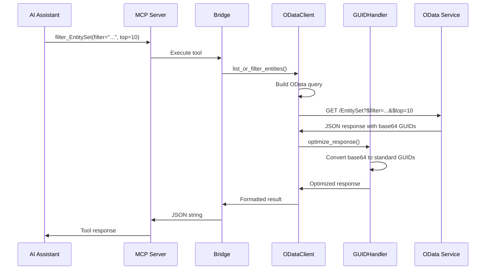

# OData MCP Wrapper - Technical Architecture

## System Overview

The OData MCP Wrapper implements a dynamic bridge between OData v2 services and the Model Context Protocol (MCP), automatically generating MCP tools based on OData metadata. The system uses a modular architecture for maintainability and scalability.

## Architecture Components

### 1. Core Modules

#### MetadataParser (`odata_mcp_lib/metadata_parser.py`)
- **Purpose**: Fetches and parses OData `$metadata` XML documents
- **Key Features**:
  - Extracts entity types, entity sets, and function imports
  - Handles authentication for metadata access
  - Falls back to service document discovery if metadata parsing fails
  - Supports various OData service implementations

#### ODataClient (`odata_mcp_lib/client.py`)
- **Purpose**: Manages HTTP communication with OData services
- **Key Features**:
  - CSRF token management for SAP services
  - Enhanced error handling and parsing
  - CRUD operations with proper error propagation
  - Session management and connection reuse
  - Response optimization and size limiting

#### ODataMCPBridge (`odata_mcp_lib/bridge.py`)
- **Purpose**: Main integration layer connecting OData and MCP
- **Key Features**:
  - Dynamic MCP tool generation from OData metadata
  - Service-aware tool naming
  - Python's `exec()` for creating functions with proper signatures
  - FastMCP server integration

#### GUIDHandler (`odata_mcp_lib/guid_handler.py`)
- **Purpose**: Handles GUID conversion and optimization
- **Key Features**:
  - Converts between base64-encoded binary GUIDs and standard format
  - Automatic response optimization
  - Field identification based on type and naming patterns

#### Data Models (`odata_mcp_lib/models.py`)
- **Purpose**: Structured data models using Pydantic
- **Components**: EntityProperty, EntityType, EntitySet, FunctionImport, ODataMetadata

#### Constants (`odata_mcp_lib/constants.py`)
- **Purpose**: OData type mappings and namespace definitions
- **Content**: PYTHON_TO_ODATA_TYPES, ODATA_NAMESPACES

### 2. System Architecture Diagram

```
┌─────────────────┐    ┌──────────────────────────────────┐    ┌─────────────────┐
│   AI Assistant  │    │        OData MCP Bridge          │    │  OData Service  │
│                 │    │                                  │    │                 │
│ ┌─────────────┐ │    │ ┌──────────────────────────────┐ │    │ ┌─────────────┐ │
│ │ MCP Client  │◄┼────┼►│        FastMCP Server        │ │    │ │  Metadata   │ │
│ └─────────────┘ │    │ └──────────────────────────────┘ │    │ │  Endpoint   │ │
└─────────────────┘    │ ┌──────────────────────────────┐ │    │ └─────────────┘ │
                       │ │      Tool Registry           │ │    │ ┌─────────────┐ │
                       │ └──────────────────────────────┘ │    │ │ Entity Sets │ │
                       │ ┌──────────────────────────────┐ │    │ └─────────────┘ │
                       │ │     ODataMCPBridge           │ │    │ ┌─────────────┐ │
                       │ └──────────────────────────────┘ │    │ │  Function   │ │
                       │ ┌──────────────────────────────┐ │    │ │   Imports   │ │
                       │ │     MetadataParser           │ │    │ └─────────────┘ │
                       │ └──────────────────────────────┘ │    └─────────────────┘
                       │ ┌──────────────────────────────┐ │
                       │ │      ODataClient             │ │
                       │ └──────────────────────────────┘ │
                       │ ┌──────────────────────────────┐ │
                       │ │      GUIDHandler             │ │
                       │ └──────────────────────────────┘ │
                       └──────────────────────────────────┘
```

### 3. Data Flow Architecture

```
┌─────────────┐    ┌──────────────┐    ┌─────────────┐    ┌──────────────┐
│ OData       │───►│ Metadata     │───►│ MCP Bridge  │───►│ MCP Tools    │
│ Service     │    │ Parser       │    │             │    │ Generated    │
└─────────────┘    └──────────────┘    └─────────────┘    └──────────────┘
       │                   │                   │                   │
       │                   ▼                   ▼                   ▼
┌─────────────┐    ┌──────────────┐    ┌─────────────┐    ┌──────────────┐
│ HTTP        │◄───│ Entity Types │◄───│ Tool        │◄───│ AI Assistant │
│ Requests    │    │ Entity Sets  │    │ Execution   │    │ Requests     │
└─────────────┘    │ Functions    │    └─────────────┘    └──────────────┘
                   └──────────────┘
```

## Tool Generation Pattern

For each OData entity set, the system generates the following MCP tools:

1. **filter_{EntitySet}** - List/filter entities with OData query options
2. **count_{EntitySet}** - Get entity count with optional filtering  
3. **search_{EntitySet}** - Full-text search (if supported)
4. **get_{EntitySet}** - Retrieve single entity by key
5. **create_{EntitySet}** - Create new entity (if creatable)
6. **update_{EntitySet}** - Update existing entity (if updatable)
7. **delete_{EntitySet}** - Delete entity (if deletable)

### Tool Naming Convention

Tools follow intelligent naming based on service identification:

- **SAP Services**: `/sap/opu/odata/sap/ZODD_000_SRV` → `ZODD_000_SRV`
- **.svc Endpoints**: `/MyService.svc` → `MyService_svc`
- **Generic Services**: `/odata/TestService` → `TestService`
- **Host-based**: `service.example.com` → `service_example_com`

Example: `filter_ProgramSet_for_ZODD_000_SRV`

## Request Processing Flow



## Error Handling Architecture

### Enhanced Error Parsing

The system implements comprehensive error handling:

```python
def _parse_odata_error(self, response):
    """Parse various OData error formats"""
    # JSON error structures
    # XML error extraction  
    # SAP-specific errors
    # Connection errors
    # HTTP status codes
```

### Error Types Handled

1. **JSON Error Structures**: Standard OData error format
2. **XML Error Extraction**: Non-JSON error responses
3. **SAP-specific Errors**: Custom SAP error formats
4. **Connection Errors**: Network and timeout issues
5. **CSRF Token Failures**: Automatic token refresh

## GUID Optimization System

### Problem
OData services return GUID fields as base64-encoded binary data:
- Takes significant space in responses
- Not human-readable
- Can cause XML serialization issues

### Solution
Automatic conversion to standard GUID format:
- Reduces response size by ~30%
- Human-readable format
- Compatible with standard tools

### Implementation
```python
# Field identification
if prop.type == "Edm.Binary" and any(name in prop.name.upper() 
                                     for name in ['ID', 'GUID', 'F', 'T']):
    guid_fields.append(prop.name)

# Conversion during response parsing
if field in guid_fields and is_base64(value):
    value = base64_to_guid(value)
```

## Response Optimization

### Size Limiting
- Configurable maximum response items
- Automatic truncation with pagination info
- Memory usage protection

### Selective Field Retrieval
- Default exclusion of large binary fields
- Configurable field selection
- Performance-optimized queries

### Example Optimization
```python
# Before: Large response with binary data
{
  "d": {
    "results": [{
      "Id": "AkkEEAAEH9CL4dDCiWvlwg==",  # Base64 binary
      "LargeBinaryField": "..."          # Excluded by default
    }]
  }
}

# After: Optimized response
{
  "results": [{
    "Id": "0242AC10-0004-1FD0-8BE1-D0C2765488C2",  # Standard GUID
    # Large fields excluded for performance
  }],
  "pagination": {
    "total_count": 100,
    "has_more": true
  }
}
```

## Security Architecture

### Authentication
- Basic authentication support
- Environment variable credential handling
- No credential exposure in logs

### CSRF Protection
- Automatic token fetching for SAP services
- Token caching and refresh logic
- Request retry on token expiration

### Input Validation
- OData query parameter validation
- Pydantic model validation
- SQL injection prevention

### Response Sanitization
- JSON encoding to prevent injection
- Sensitive data protection in error messages
- Proper HTTP status code handling

## Performance Optimizations

### Lazy Loading
- Metadata fetched once on startup
- On-demand tool generation
- Minimal memory footprint

### Session Reuse
- HTTP session maintained for connection pooling
- Persistent authentication
- Reduced connection overhead

### Query Optimization
- Default field selection reduces payload
- Automatic GUID field handling
- Response size limiting

### Caching Strategy
- Stateless design (no response caching)
- Session-level connection reuse
- Metadata caching for duration of service

## Module Dependencies

```
odata_mcp.py
    ├── odata_mcp_lib.bridge (ODataMCPBridge)
    │   ├── odata_mcp_lib.metadata_parser (MetadataParser)
    │   ├── odata_mcp_lib.client (ODataClient)
    │   │   ├── odata_mcp_lib.guid_handler (ODataGUIDHandler)
    │   │   └── odata_mcp_lib.models (Pydantic models)
    │   └── odata_mcp_lib.constants (Type mappings)
    └── fastmcp (FastMCP framework)
```

## Deployment Architecture

### Single Process Deployment
```bash
# Direct execution
python odata_mcp.py --service <url> --user <user> --password <pass>
```

### Environment Configuration
```bash
# Environment variables
ODATA_SERVICE_URL=https://service.com/odata/
ODATA_USERNAME=user
ODATA_PASSWORD=pass
```

### Container Deployment (Future)
```dockerfile
FROM python:3.8-slim
COPY . /app
WORKDIR /app
RUN pip install -r requirements.txt
CMD ["python", "odata_mcp.py"]
```

## Monitoring and Observability

### Logging Architecture
- Structured logging with levels
- Verbose mode for debugging
- Error tracking and correlation
- Performance metrics logging

### Health Checks
- Service connectivity verification
- Metadata accessibility validation
- Authentication status monitoring

### Metrics Collection (Future)
- Request/response times
- Error rates by type
- Tool usage statistics
- Resource utilization

## Scalability Considerations

### Horizontal Scaling
- Stateless design enables multiple instances
- No shared state between requests
- Load balancer compatible

### Vertical Scaling
- Memory usage optimization
- CPU-efficient parsing
- Configurable response limits

### Connection Management
- Session pooling
- Connection timeout handling
- Resource cleanup

## Future Architecture Enhancements

### OData v4 Support
- Enhanced metadata parser
- v4-specific feature support
- Backward compatibility maintenance

### Batch Operations
- Multiple operation composition
- Transaction boundary management
- Parallel execution optimization

### Advanced Authentication
- OAuth 2.0 integration
- SAML support
- Certificate-based auth

### Event System
- Change notifications
- Webhook support
- Real-time data synchronization

---

**Architecture Status**: Production Ready ✅  
**Modularity**: 7 focused components ✅  
**Scalability**: Stateless and horizontally scalable ✅