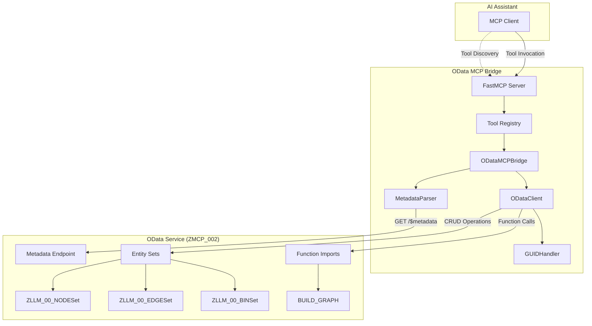
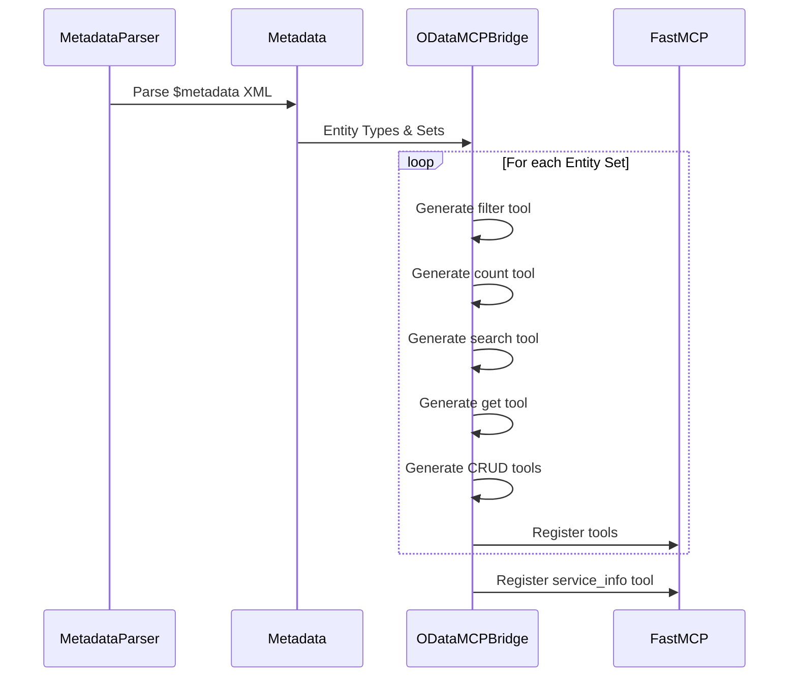
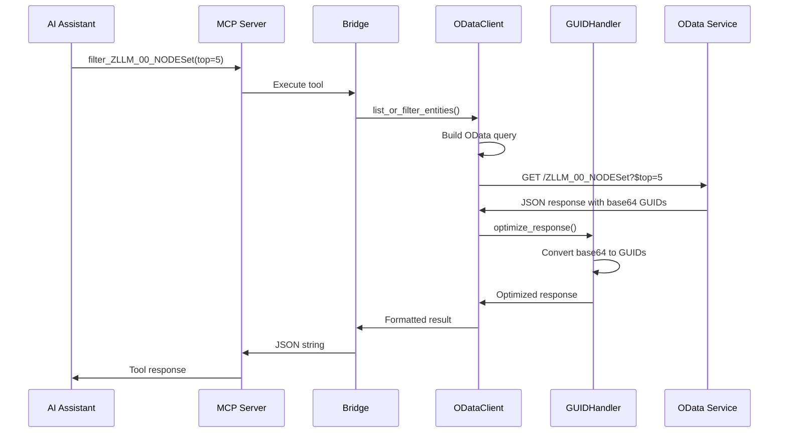
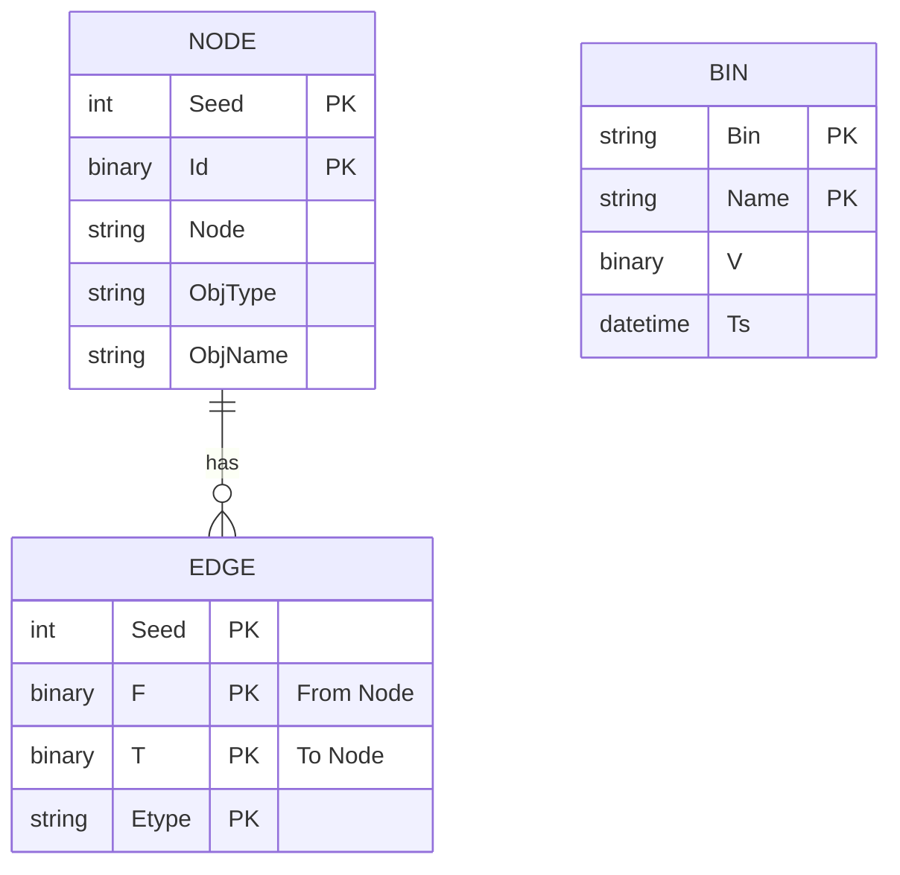

# OData to MCP Bridge - Visual Architecture

## System Architecture Diagram



## Tool Generation Flow



## Request Flow Example



## Data Transformation Pipeline

```
Raw OData Response          Optimized Response
─────────────────          ─────────────────
{                          {
  "d": {                     "results": [{
    "results": [{              "Seed": 0,
      "Seed": 0,               "Id": "0242AC10-0004-1FD0-8BE1-D0C2",
      "Id": "AkkEEAA...",      "Node": "DEVC.$ZXRAY",
      "Node": "DEVC.$ZXRAY",   "ObjType": "DEVC"
      "ObjType": "DEVC"      }],
    }]                       "_truncated": false,
  }                          "pagination": {
}                              "total_count": 100,
                              "has_more": true
                            }
                          }
```

## Entity Relationships in ZMCP_002

